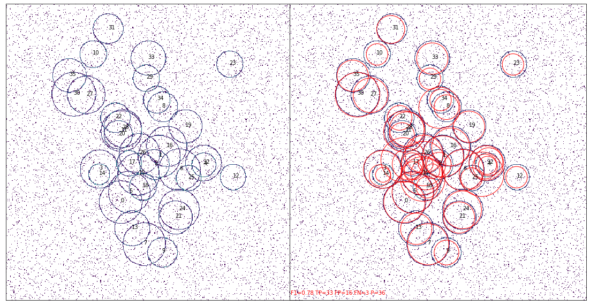

# `smeagol`
Welcome to the `smeagol` project.
This package implements a simple ring finder based on convolutions of
well chosen kernel functions with an image in order to localize
overlapping rings of various radii. 
This methodology extends the Hough transformation with convolutional
techniques and introduces two
novel components.
1. Gaussian Annulus Kernel
1. Estimation of the variance under a convolutional window

The first component extends the Hough transformation by convolving the
expected pattern, a circle, with an image.  The second component helps
fight the self-induced background formed by overlapping rings.  The
variance of the signal around the polar angle is used to help
reduce the false positive rate.

The images below show an example of `smeagol` in action.
The image on the left shows a raw image having 36 rings of various radii
randomly scattered throughout.  The image on the left shows the same raw
image with the rings identified by `smeagol` highlighted in red.

# License
This software is released under the [MIT](LICENSE.txt) license.

